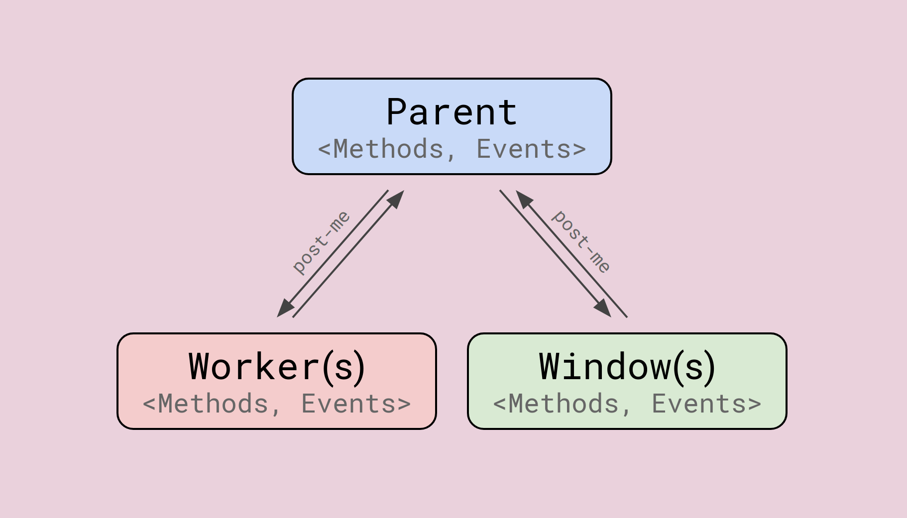
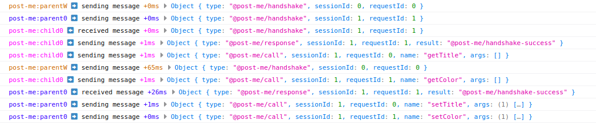

[](https://github.com/alesgenova/post-me/actions?query=workflow%3Amain+branch%3Amain)
[](https://www.npmjs.com/package/post-me)
[](https://codecov.io/gh/alesgenova/post-me)

<h1 align="center">post-me</h1>

<p align="center">Communicate with web <code>Workers</code> and other <code>Windows</code> using a simple <code>Promise</code> based API</p>



With __post-me__ it is easy for a parent (for example the main app) and a child (for example a worker or an iframe) to expose methods and custom events to each other.

Main features:
- Parent and child can both expose methods and/or events.
- Strong typing of method names, arguments, return values, as well as event names and payloads.
- Establish multiple concurrent connections.
- Easily extensible to more use cases.
- No dependencies: 2kb gzip bundle.
- Excellent test coverage.
- Open source (MIT)

## Demo
In this [live demo](https://alesgenova.github.io/post-me/) a parent window achieves two-way communication with its 5 children (4 iframes and 1 web worker).

## Usage
To establish a connection between two windows follow the steps below:
  - Create a `Messenger`, an object implementing the low level communication (`WindowMessenger` and `WorkerMessenger` already provided).
  - Initiate a handshake between the parent window and the child window by calling the `ParentHandshake()` and `ChildHandshake()` methods respectively.
  - The `methods` parameter contains the methods that each window will expose to the other.
  - The handshake returns a `Promise<Connection>` to the two windows.
  - Get a handle to the other window by calling the `connection.getRemoteHandle()` method.
    - Use `remoteHandle.call(methodName, ...args)` to call methods on the other window. It returns a `Promise` of the result.
    - Use `remoteHandle.addEventListener(eventName, callback)` to listen to specific events dispatched by the other window.
    - Use `remoteHandle.removeEventListener(eventName, callback)` to remove listeners.
  - Get a handle to the local window by calling the `connection.getLocalHandle()` method.
    - Use `localHandle.emit(eventName, payload)` to emit a specific event with the given payload.

Refer to the code snippet below as an example of these steps.

### Parent code
```typescript
import { ParentHandshake, WindowMessenger } from 'post-me';

// Create the child window any way you like (iframe here, but could be popup or tab too)
const childFrame = document.createElement('iframe');
childFrame.src = './child.html';
const childWindow = childFrame.contentWindow;

// Define the methods you want to expose to the other window.
// Methods can either return values or Promises
const methods = {
  foo: (s, x) => s.length * x,
  bar: (x) => Promise.resolve(x * 2),
}

// Start the handshake
// For safety it is strongly adviced to pass the explicit child origin instead of '*'
const messenger = new WindowMessenger({
  remoteWindow: childWindow,
  remoteOrigin: '*'
});
ParentHandshake(messenger, methods)
  .then((connection) => {
    const localHandle = connection.localHandle();
    const remoteHandle = connection.remoteHandle();

    // Call a method on the child
    remoteHandle.call('baz', 3)
      .then((value) => {
        console.log(value); // 9
      })

    // Listen for an event emitted by the child
    remoteHandle.addEventListener('some-child-event', (payload) => {
      console.log(payload) // 'Hi from child'
    });

    // Emit an evevent
    localHandle.emit('some-parent-event', 'Hi from parent');
  })
```

### Child code
```typescript
import { ChildHandshake, WindowMessenger } from 'post-me';

// Define the methods you want to expose to the other window.
// Methods can either return values or Promises
const methods = {
  baz: (x) => x * 3,
}

// Start the handshake
// For safety it is strongly adviced to pass the explicit parent origin instead of '*'
const messenger = new WindowMessenger({
  remoteWindow: window.parent,
  remoteOrigin: '*'
});
const messenger = new WindowMessenger({ remoteOrigin: '*' });
ChildHandshake(messenger, methods)
  .then((connection) => {
    const localHandle = connection.localHandle();
    const remoteHandle = connection.remoteHandle();

    // Call a method on the parent
    remoteHandle.call('foo', 'ciao', 2)
      .then((value) => {
        console.log(value); // 8
      })

    // Listen for an event emitted by the child
    remoteHandle.addEventListener('some-parent-event', (payload) => {
      console.log(payload) // 'Hi from parent'
    });

    // Emit an evevent
    localHandle.emit('some-child-event', 'Hi from child');
  })
```

## Typescript
Thanks to __post-me__ extensive typescript support, the correctness of the following items can be statically checked during development:
- Method names
- Argument number and types
- Return values type
- Event names
- Event payload type

Ideally methods and events types should be defined in a place accessible to the code of both parent and child, so that they can both import the same type definition. This way, it will be ensured that the contract between the parties will be enforced.

Below a modified version of the previous example using typescript.

### Common code
```typescript
// common.ts

export type ParentMethods = {
  foo: (s: string, x: number) => number;
  bar: (x: number) => Promise<number>;
};

export type ParentEvents = {
  'some-parent-event': string;
}

export type ChildMethods = {
  baz: (x: number) => number;
};

export type ChildEvents = {
  'some-child-event': string;
}
```

### Parent code
```typescript
import { ParentHandshake, WindowMessenger, LocalHandle, RemoteHandle } from 'post-me';

import { ParentMethods, ParentEvents, ChildMethods, ChildEvents} from '/path/to/common';

// Create the child window any way you like (iframe here, but could be popup or tab too)
const childFrame = document.createElement('iframe');
childFrame.src = './child.html';
const childWindow = childFrame.contentWindow;

// Define the methods you want to expose to the other window.
// Methods can either return values or Promises
const methods: ParentMethods = {
  foo: (s, x) => s.length * x,
  bar: (x) => Promise.resolve(x * 2),
}

// Start the handshake
// For safety it is strongly adviced to pass the explicit child origin instead of '*'
const messenger = new WindowMessenger({
  remoteWindow: childWindow,
  remoteOrigin: '*'
});
ParentHandshake(messenger, methods)
  .then((connection) => {
    const localHandle: LocalHandle<ParentEvents> = connection.localHandle();
    const remoteHandle: RemoteHandle<ChildMethods, ChildEvents> = connection.remoteHandle();

    // Call a method on the child
    remoteHandle.call('baz', 3)
      .then((value) => {
        console.log(value); // 9
      })

    // Listen for an event emitted by the child
    remoteHandle.addEventListener('some-child-event', (payload) => {
      console.log(payload) // 'Hi from child'
    });

    // Emit an evevent
    localHandle.emit('some-parent-event', 'Hi from parent');
  })
```

### Child code
```typescript
import { ChildHandshake, WindowMessenger, LocalHandle, RemoteHandle } from 'post-me';

import { ParentMethods, ParentEvents, ChildMethods, ChildEvents} from '/path/to/common';

// Define the methods you want to expose to the other window.
// Methods can either return values or Promises
const methods: ChildMethods = {
  baz: (x) => x * 3,
}

// Start the handshake
// For safety it is strongly adviced to pass the explicit parent origin instead of '*'
const messenger = new WindowMessenger({
  remoteWindow: window.parent,
  remoteOrigin: '*'
});
ChildHandshake(messenger, methods)
  .then((connection) => {
    const localHandle: LocalHandle<ChildEvents> = connection.localHandle();
    const remoteHandle: RemoteHandle<ParentMethods, ParentEvents> = connection.remoteHandle();

    // Call a method on the parent
    remoteHandle.call('foo', 'ciao', 2)
      .then((value) => {
        console.log(value); // 8
      })

    // Listen for an event emitted by the child
    remoteHandle.addEventListener('some-parent-event', (payload) => {
      console.log(payload) // 'Hi from parent'
    });

    // Emit an evevent
    localHandle.emit('some-child-event', 'Hi from child');
  })
```

## Workers
A minimal example of using __post-me__ with a web worker can be found in the demo source code.
  - Parent: [source](https://github.com/alesgenova/post-me/blob/main/demo/parent.js#L162-L165)
  - Worker: [source](https://github.com/alesgenova/post-me/blob/main/demo/worker.js)

### Parent code
```typescript
import { ParentHandshake, WorkerMessenger } from 'post-me';

// Create a dedicated web worker.
const worker = new Worker('./worker.js');

// Start the handshake
const messenger = new WorkerMessenger({ worker });

ParentHandshake(messenger).then((connection) => {
  const remoteHandle = connection.remoteHandle();

  // Call a method on the worker
  remoteHandle.call('sum', 3, 4)
    .then((value) => {
      console.log(value); // 7
    });

  remoteHandle.call('mul', 3, 4)
    .then((value) => {
      console.log(value); // 12
    });
})
```

### Worker code
```typescript
importScripts('./post-me.js');
const PostMe = self['post-me'];

const methods = {
  sum: (x, y) => x + y,
  mul: (x, y) => x * y,
};

const messenger = new PostMe.WorkerMessenger({ worker: self });
PostMe.ChildHandshake(messenger, methods).then((_connection) => {
  console.log('Worker successfully connected');
});
```

## Debugging
__post-me__ provides facilities to inspect each low level message exchanged between the two ends.

To enable debugging, simply decorate any `Messenger` instance with the provided `DebugMessenger` decorator.

You can optionally pass to the decorator your own logging function (a glorified `console.log` by default), which can be useful to make the output more readable, or to inspect messages in automated tests.

### Example
```typescript
import { ParentHandshake, WindowMessenger, DebugMessenger } from 'post-me';

import debug from 'debug';          // Use the full feature logger from the debug library
// import { debug } from 'post-me'; // Or the lightweight implementation provided

let messenger = new WindowMessenger({
  localWindow: window,
  remoteWindow: childWindow,
  remoteOrigin: '*'
});

// To enable debugging of each message exchange, decorate the messenger with DebugMessenger
const log = debug('post-me:parent'); // optional
messenger = DebugMessenger(messenger, log);

ParentHandshake(messenger).then((connection) => {
  // ...
});

```

### Output


## References
The __post-me__ API is loosely inspired by [postmate](https://github.com/dollarshaveclub/postmate), with several major improvements and fixes to outstanding issues:
- Native typescript support
- Method calls can have both arguments and a return value: ([#94](https://github.com/dollarshaveclub/postmate/issues/94))
- Parent and child can both expose methods and/or events (instead of child only): [#118](https://github.com/dollarshaveclub/postmate/issues/118)
- Exceptions that occur in a method call can be caught by the caller.
- Better control over handshake origin and attempts: ([#150](https://github.com/dollarshaveclub/postmate/issues/150), [#195](https://github.com/dollarshaveclub/postmate/issues/195))
- Multiple listeners for each event: ([#58](https://github.com/dollarshaveclub/postmate/issues/58))
