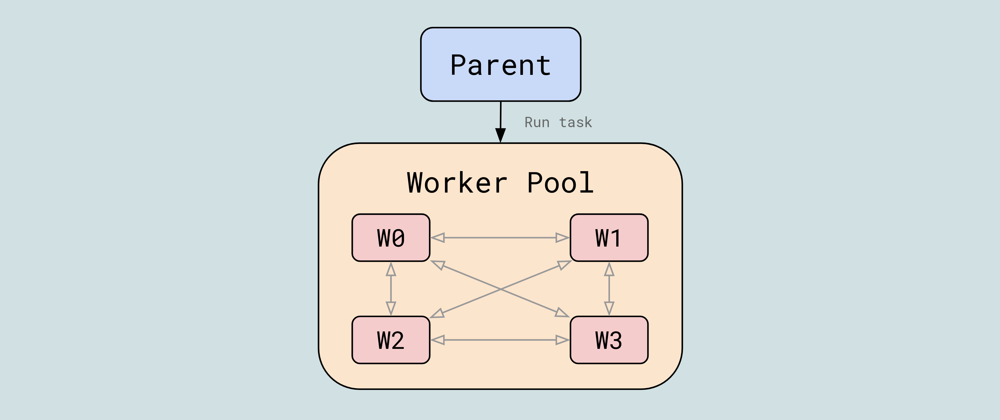
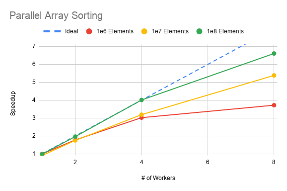

<h1 align="center">@post-me/mpi</h1>

<p align="center">Write parallel algorithms in JavaScript using a MPI-like API.</p>



__@post-me/mpi__ is a library to write parallel algorithms that can run on a pool of web workers, using an API similar to [MPI](https://en.wikipedia.org/wiki/Message_Passing_Interface).

A worker pool is a set of workers that are mutually interconnected. Each worker can communicate directly with any other worker in the pool.

The low level communication between workers and the parent application is managed by __post-me__.

## Usage

Below is a small example of using __@post-me/mpi__ in practice. In this example we will be sorting an array in parallel.

Worker code:
```javascript
import { joinPool } from '@post-me/mpi';

const connection = await joinPool(self);

// The parallel sort method
const sort = (communicator) => async (array) => {
  const root = 0;
  let subArray = await communicator.scatter(array, root);
  subArray.sort((a, b) => a - b);
  const sorted = await communicator.reduce(subArray, merge, root);

  return sorted;
}

// Expose parallel methods to the application
connection.registerMethods({ sort });

// Merge two sorted arrays into a single sorted array
function merge(a0, a1) {/* ... */}
```

Parent code:
```javascript
import { createPool } from '@post-me/mpi';

const array = new Float32Array(1024);
const N_WORKERS = 4;

// Create the workers
const workers: Worker[] = [];
for (let i = 0; i < N_WORKERS; ++i) {
  workers.push(new Worker('./worker.js'));
}

// Create a pool of mutually interconnected workers
const workerPool = await createPool(workers);

// Pass different parameter to the parallel method based on the rank of the worker
const root = 0;
const args = (rank) => rank === root ? array : null;
const transfer = (rank, [arr]) => rank === root ? [arr.buffer] : [];

// Call the parallel method 'sort'
const result = await workerPool.call('sort', args, transfer);

// The sorted array is returned by the root worker
const sortedArray = result[root];
```

## MPI Operations

The following MPI operations are already implemented in __@post-me/mpi__:
- `send`
- `recv`
- `bcast`
- `scatter`
- `gather`
- `reduce`
- `barrier`
- `allGather`
- `allReduce`

## Typescript

The library has extensive typescript support, all arguments, methods, return types, etc., are all type checked so that most coding mistakes can be caught at compile tim.

## Benchmark
Below is a quick non-scientific benchmark that shows that indeed running a parallel algorithm is faster than serial. In the plot I'm showing the speedup obtained when sorting arrays of various length as a function of the number of workers.



## Demo
I created a small [demo page](https://alesgenova.github.io/post-me-demo/mpi/) where you can run a couple of test algorithms yourself ([source](https://github.com/alesgenova/post-me-demo/tree/main/examples/mpi)).
